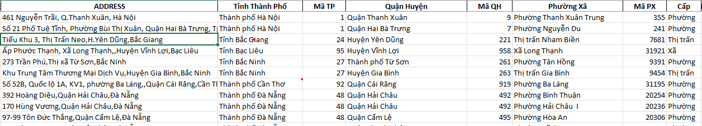

# CUNG NHAU HOC R
## 1. STRINGR
- [Du lieu raw ve dia chi](https://github.com/kienvtm/learn_r/blob/main/raw_clean_address.csv)
- [Danh muc dia chinh](https://github.com/kienvtm/learn_r/blob/2b8b0f5fa51f4dfeb43c5da66f31152f05c942ee/Danh%20s%C3%A1ch%20c%E1%BA%A5p%20t%E1%BB%89nh%20k%C3%A8m%20theo%20qu%E1%BA%ADn%20huy%E1%BB%87n%2C%20ph%C6%B0%E1%BB%9Dng%20x%C3%A3%20___25_08_2023.csv)
- Muc dich: phan loai cac dia chi o file raw theo danh muc dia chinh de ra duoc ket qua nhu file nay:
  
